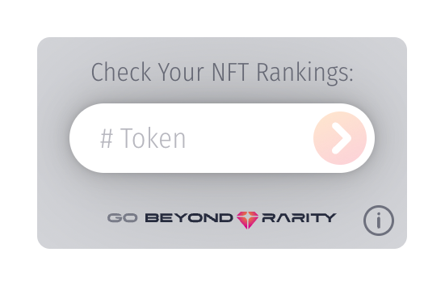
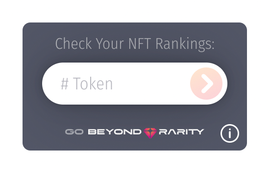

# Beyond Rarity Instacheck Widget
This page has instructions for the React component.

If you are using plain JS you can see instructions here: https://www.npmjs.com/package/@beyondrarity/instacheck-js

<p float="left">
  
  
</p>


### Check out the [BR-InstaCheck Widget Live Demo](https://codepen.io/nicopanfili/pen/GRxmPeW) on CodePen.

## Installation
Using **NPM**:

`
npm i @beyondrarity/instacheck
`

Using **YARN**:

`
yarn add @beyondrarity/instacheck
`

## Usage
Import the component and use it:
```jsx
import Instacheck from '@beyondrarity/instacheck'

const Example = () => (
    <div>
        <h1>Beyond Rarity Checker</h1>
        <BRChecker 
            collectionId="wallstmoms" 
            startTokenId={1}
            endTokenId={3000}
            theme="light"
        />
    </div>
)
```

### Component  Props:
Prop | Description | Required      
------- | :---------------- | :----------:
`collectionId`  | The Collection Id which is the unique identifier for your collection (also called slug).The Collection Id is available in the URL when navigating to your collection on [Beyond Rarity](https://www.beyondrarity.com) which is in the following format:<br><br>`www.beyondrarity.com/c/[collectionId]`<br><br>For example, the URL for the `Wall St Moms` collection is https://www.beyondrarity.com/c/wallstmoms where `wallstmoms` is the `collectionId`.| `yes`
`startTokenId`  |The first token id in the collection which is normally `1` or `0`. | `yes`
`endTokenId`   |  The last token id in the collection which is normally:<br>- `equal to the supply if the first token id is 1`<br>- `or equal to the (supply - 1) if the first token id is 0`  | `yes`
`theme` | `"dark"` or `"light"` | `No`.Default value is `"light"`

For example, the [Wall St Moms](https://www.beyondrarity.com/c/wallstmoms) collection has a start token id of 1, a supply of 3000, and end token id of 3000.
